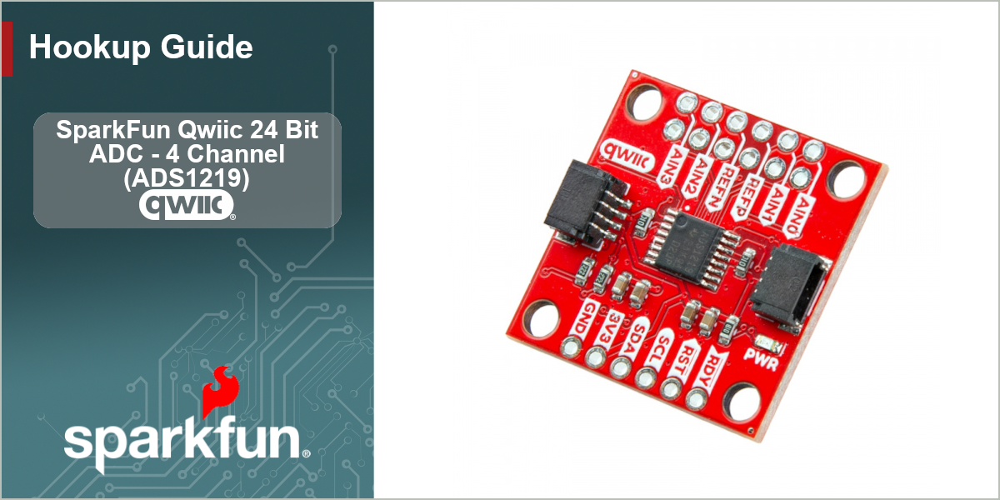

<figure markdown>
[{ width="600"}](./assets/img/Qwiic_ADC-HGBanner.png)
</figure>

The [SparkFun Qwiic 24 Bit ADC - 4 Channel (ADS1219)](https://sparkle.sparkfun.com/sparkle/products/27544) is a simple Qwiic breakout board for the ADS1219 Analog-to-Digital converter. This breakout lets you add four channels of I2C controlled ADC input to your project. The ADS1219's channels can be used as single-ended inputs or in pairs for differential inputs and run at sample rates of up to 1kHz. The ADC also has a programmable gain amplifier (x1 or x4) to allow you to "zoom in" on very small changes in analog voltage (though this affects the input range and resolution). The ADS1219 has an internal 2.048V reference voltage but also allows for an external reference via the REFP/REFN PTH pads broken out on the board. This breakout naturally routes the power and I2C lines to a pair of Qwiic connectors for easy integration into a Qwiic circuit. Lastly, this breakout nets both of the ADS1219's supply voltages (analog/AVDD and digital/DVDD) to a single input but you can provide your own analog by opening the 3V3/VDDA jumper and connecting a voltage supply to the VDDA PTH pad. 

In this guide we'll cover everything you need to familiarize yourself with this Qwiic breakout, assemble it into a Qwiic circuit and how to use it with the SparkFun ADS1219 Arduino Library.

## Required Materials

In order to use this Qwiic breakout board, you'll need the following materials:

* [SparkFun RedBoard IoT - ESP32](https://www.sparkfun.com/sparkfun-iot-redboard-esp32-development-board.html) (or other Arduino development board)
* [Qwiic Cable](https://www.sparkfun.com/flexible-qwiic-cable-100mm.html)
* An analog input such as a flex sensor, force-sensitive resistor or load cell. You can find all types of each of these sensors in our [Flex/Force Category](https://www.sparkfun.com/sensors/flex.html).

### Quick Start Materials

If you'd like to build the demo circuit in the Quick Start guide you'll need the following extra items:

* [Flex Sensor 2.2"](https://www.sparkfun.com/flex-sensor-2-2.html)
* [10k&ohm; Resistor Pack (100)](https://www.sparkfun.com/resistor-10k-ohm-1-4-watt-pth-20-pack-thick-leads.html)
* [M/F Jumper Wires](https://www.sparkfun.com/jumper-wires-premium-6-m-f-pack-of-10.html)
* [Breadboard](https://www.sparkfun.com/development-boards/prototyping-boards/breadboard.html)

## Topics Covered

This guide contains three main sections: **Quickstart Guide**, **Hardware** and **Software**. 

The Quickstart Guide goes over a simple demo circuit for the Qwiic ADC - AS1219 using a flex sensor to read voltage changes using the SparkFun ADS1219 Arduino Library. This section assumes a working knowledge of how to use a development board with Arduino, through-hole soldering and building prototype circuits using a breadboard.

The Hardware section provides a detailed overview of the ADS1219 and other hardware present on the Qwiic 24 Bit ADC as well as instructions on assembling it into a Qwiic circuit.

The Software section covers how to install the SparkFun AS1219 Arduino Library along with brief overviews of some of the examples included in the library.

## Resources and Support Documentation

You'll find the board design files (KiCad files & schematic), relevant documentation (datasheets, white papers, etc.) and other helpful links in the **Resources**. Lastly, the **Support** section includes a Troubleshooting page that includes any helpful tips specific to this board as well as information on how to receive technical support from SparkFun.