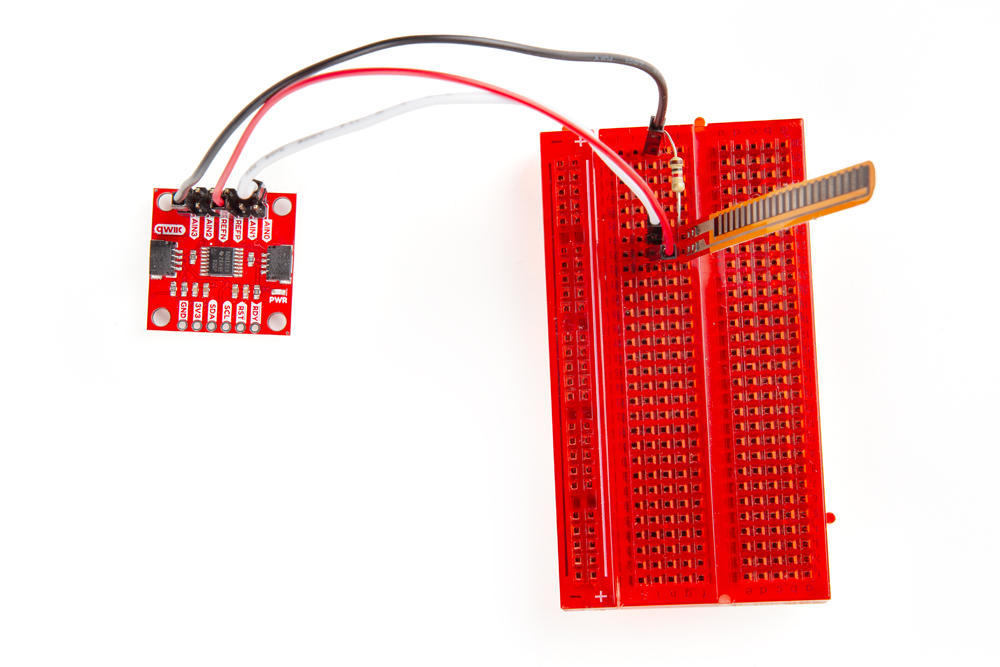
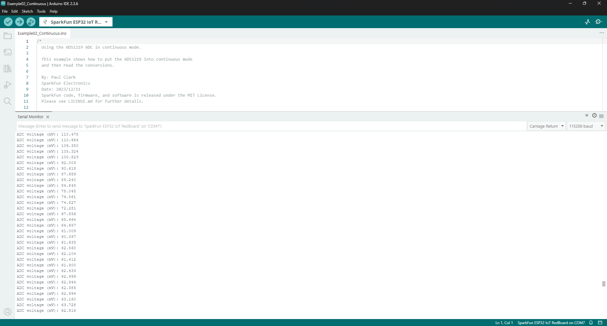

In this Quick Start guide we'll go over how to assemble the SparkFun Qwiic 24 Bit ADC - 4 Channel (ADS1219) in a Qwiic circuit to measure the output voltage of a flex sensor assembled to function as a voltage divider. 

This guide assumes users have a basic understanding of using Qwiic breakout and development boards, through-hole soldering, breadboard prototyping as well as how to use the Arduino IDE. If you're not familiar with all of these concepts, read on through the rest of this Hookup Guide for detailed information on how to use this breakout board with the Arduino IDE.

## Flex Sensor Demo Assembly

Since we're doing some prototype testing with this board, we opted to solder male headers to the Qwiic ADC - AS1219's PTH pads to easily connect jumper wires to the board.

Connect the flex sensor to the Qwiic ADC - AS1219 with the following steps:

* Plug the flex sensor into the breadboard.
* Connect one leg of a 10k&ohm; resistor to one of the flex sensor's pins and the other to a free row on the breadboard.
* Take one jumper wire (white wire in the photo below) and connect AIN0 on the Qwiic ADC to same row on the breadboard as the Flex Sensor pin connected to the 10k&ohm; resistor.
* Next, use a second jumper wire (red wire in the photo below) to connect the flex sensor's other pin to the Qwiic ADC's VDDA pin (this label is on the bottom of the board).
* Now use the third jumper wire (black wire in the photo below) and connect the other or "free" end of the 10k&ohm; resistor to one of the ground pins on the Qwiic ADC.

Your circuit should look similar to the photo below:

<figure markdown>
[{ width="600"}](./assets/img/Qwiic_ADC-Flex_Sensor.jpg "Click to enlarge")
</figure>

Now that we've finished assembling our flex sensor circuit, it's time to connect the Qwiic ADC - AS1219 to our RedBoard IoT - ESP32. Simply connect the two together with a Qwiic cable plugged into the Qwiic connectors:

<figure markdown>
[{ width="600"}](./assets/img/Qwiic_ADC-Completed_Assembly.jpg "Click to enlarge")
</figure>

## Arduino Example

For this example, we'll be using a slightly modified version of Example 01 - Single Shot from the [SparkFun AS1219 Arduino Library](https://github.com/sparkfun/SparkFun_ADS1219_Arduino_Library).

* Open the [Arduino IDE](https://docs.arduino.cc/software/ide-v2/tutorials/getting-started-ide-v2/).
* Open the [Library Manager](https://docs.arduino.cc/software/ide-v2/tutorials/ide-v2-installing-a-library/) tool, search for "SparkFun AS1219" and install the latest version. This library was built using the [SparkFun Toolkit](https://github.com/sparkfun/SparkFun_Toolkit) so if you have not already installed it, search for "SparkFun Toolkit" in the Library Manager to install the dependency. 
* Open "Example 01 - Single Shot".
* Add the following code to the <code>void setup()</code> below this line: <code>Serial.println("ADC initialized");</code>:
``` c++
  myADC setInputMultiplexer(ADS1219_CONFIG_MUX_SINGLE_0);

  Serial println("Reading from A0");
```
* Select your Board (SparkFun RedBoard IoT - ESP32 or other board) and Port and click "Upload".
* After the code compiles and finishes uploading, open the [serial monitor](https://docs.arduino.cc/software/ide-v2/tutorials/ide-v2-serial-monitor/) with the baud set to **115200**.
* Now, gently bend the flex sensor and you should see the voltage readings move down like the screenshot below. Continue flexing the sensor and it should drop further or release it and the voltages should jump back up.

<figure markdown>
[{ width="600"}](./assets/img/Qwiic_ADC-Arduino_Example.png "Click to enlarge")
</figure>

**Code to Note**

The Single Shot example defaults to measure a differential input from the A0 and A1 channels so in the instructions above we modified the code to configure the ADS1219 to just read a single input on A0 using the <code>setInputMultiplexer()</code> function and then perform a serial print informing of the change:
``` c++
  myADC setInputMultiplexer(ADS1219_CONFIG_MUX_SINGLE_0);

  Serial println("Reading from A0");
```

The main loop of this example attempts to start a single-shot conversion and waits for it to complete every 10ms:

``` c++
  if (myADC.startSync()) // Start a single-shot conversion. This will return true on success.
  {
    while (myADC.dataReady() == false) // Check if the conversion is complete. This will return true if data is ready.
    {
      delay(10); // The conversion is not complete. Wait a little to avoid pounding the I2C bus.
    }    
```

If that single-shot conversion completes, we read the result, convert it to millivolts and print out that value with three decimal points. If it fails, it prints out a failure message and waits one second before attempting again:

``` c++
    myADC.readConversion(); // Read the conversion result from the ADC. Store it internally.
    float milliVolts = myADC.getConversionMillivolts(); // Convert to millivolts.
    Serial.print("ADC voltage (mV): ");
    Serial.println(milliVolts, 3); // Print milliVolts with 3 decimal places
  }
  else
  {
    Serial.println("ADC start conversion failed. Please check your wiring! Retrying...");
    delay(1000);
  }
```


